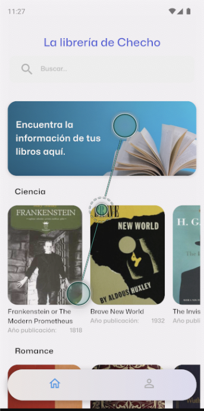
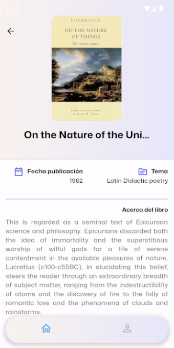
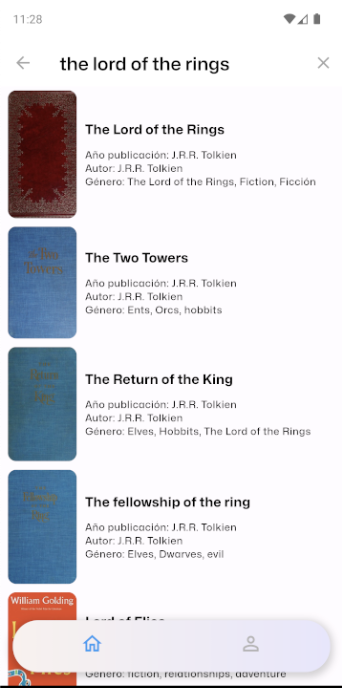
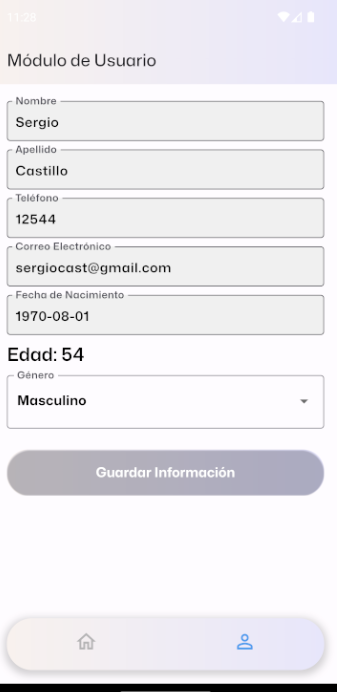
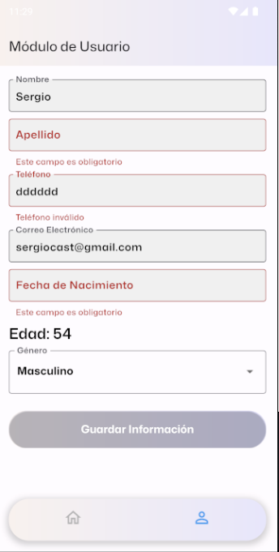

# BookLibrary - Flutter

## Descripción

Se trata de una aplicación en Flutter compatible con iOS y Android, diseñada como biblioteca de libros, donde se pueden encontrar por categorias, con su información.


## Características

| Funcionalidad                          | Descripción                                                                                                     |
|----------------------------------------|-----------------------------------------------------------------------------------------------------------------|
| Búsqueda de Libros                     | Permite buscar libros por nombre e inmediatamente muestra una lista de resultados. |
| Detalle del Libro                      | Ofrece una vista detallada del libro seleccionado con la opción de volver a la búsqueda.                         |
| Formulario de Usuario                  | Incluye campos para nombres, apellidos, teléfono, email, fecha de nacimiento, edad y género.                      |
| Validación y Almacenamiento de Datos   | Valida los campos del formulario y almacena los datos en las preferencias del usuario.                            |


### Requisitos de Desarrollo

- **Flutter**:
  - **Versión Requerida**: 3.7.0
  - Para instalar Flutter, por favor consulte la [documentación oficial](https://flutter.dev/docs/get-started/install).
  
- **Dart**:
  - **Versión Requerida**: 3.2.3
  - Más información en [dart.dev](https://dart.dev/get-dart).

- **Emulador**:
  - Se desarrollo y probo la aplicación utilizando un emulador Android configurado en Android Studio. Se recomienda usar un emulador con Android 12 o superior para asegurar la compatibilidad con las últimas características.

## Instalación

1. **Clone o descargue el repositorio:**

   ```bash
   git clone https://github.com/SergioCamiloCastillo/open_library_books_flutter
2. **Ingrese al directorio del proyecto:**
3. **Instale las dependencias:**
   ```bash
   flutter pub get
4. **Ejecute la aplicación:**
   ```bash
   flutter run

## Herramientas Utilizadas

| Herramienta          | Descripción                                                                                                             | Enlace                                         |
|----------------------|-------------------------------------------------------------------------------------------------------------------------|------------------------------------------------|
| Flutter              | Framework para desarrollar aplicaciones nativas para móviles, web y escritorio desde una única base de código.         | [Flutter](https://flutter.dev/)               |
| dio                  | Cliente HTTP para Dart con soporte para solicitudes RESTful y otras funcionalidades.                                    | [dio](https://pub.dev/packages/dio)            |
| flutter_riverpod     | Proveedor de estado para Flutter fácil de usar y compatible con el árbol de widgets.                                     | [flutter_riverpod](https://pub.dev/packages/flutter_riverpod) |
| go_router            | Enrutador de navegación para Flutter que facilita la gestión de rutas en la aplicación.                                 | [go_router](https://pub.dev/packages/go_router) |
| shared_preferences   | Almacenamiento persistente para datos simples en Flutter.                                                                | [shared_preferences](https://pub.dev/packages/shared_preferences) |

## Arquitectura implementada

En este proyecto, se siguen los principios de arquitectura limpia al organizar las carpetas y los diferentes componentes del sistema. La capa de dominio define las reglas de negocio y las abstracciones esenciales de la aplicación, se encuentran las definiciones de las entidades, los repositorios y las fuentes de datos; En la capa de infraestructura, se gestionan las tareas relacionadas con la manipulación de datos y la comunicación con recursos externos; y por ultimo, en la capa de presentación, se ocupan de la interfaz de usuario y la interacción del usuario

## Almacenamiento

Se utilizo shared_preferences para gestionar datos de manera local para guardar los datos de formulario del usuario.

## Gestor de estado

Se uso como Riverpod como gestor de estado para el manejo de los libros(carga y busqueda de libros)


## Flujo de Trabajo (Clean Architecture) 
El flujo de trabajo sigue un patrón claro para garantizar la separación de preocupaciones y mantener un código limpio y mantenible. Aquí se detalla el proceso:

**1. Interacción en la Capa de Presentación:**
  * El usuario interactúa con la interfaz de usuario en la capa de presentación.
  * El controlador en la capa de presentación captura las acciones del usuario y las procesa.

**2. Inicio de Solicitud desde el Controlador:**
  * El controlador inicia una solicitud basada en las acciones del usuario.

**3. Viaje a través de los Casos de Uso:**
  * La solicitud viaja a través de los casos de uso que contienen la lógica de negocio asociada.
  * Los casos de uso coordinan y orquestan la ejecución de la lógica de negocio específica para la solicitud.

**4. Acceso a Datos a través de Repositorios:**
  * Los casos de uso acceden a los datos necesarios a través de repositorios.
  * Los repositorios actúan como una capa intermedia que interactúa con los datasources.

**5. Comunicación con Datasources:**
  * Los repositorios se comunican con datasources, que pueden ser bases de datos, servicios web o almacenamiento local.
  * Los datasources recuperan, modifican o almacenan datos según sea necesario.

**6. Procesamiento de Datos:**
  * Los datos obtenidos de los datasources se procesan según las necesidades de la lógica de negocio.

**7. Devolución a la Capa de Presentación:**
  * Los datos procesados se devuelven a la capa de presentación a través de los casos de uso.

**8. Independencia de Datos de la Capa de Presentación:**
  * La separación de la capa de presentación y los datos garantiza que la lógica de negocio y los datos se mantengan independientes.
  * Esto facilita el mantenimiento y mejora la legibilidad del código.

Este flujo de trabajo asegura una clara separación de responsabilidades y promueve buenas prácticas de arquitectura de software en el desarrollo del proyecto.

## Capturas de pantalla





